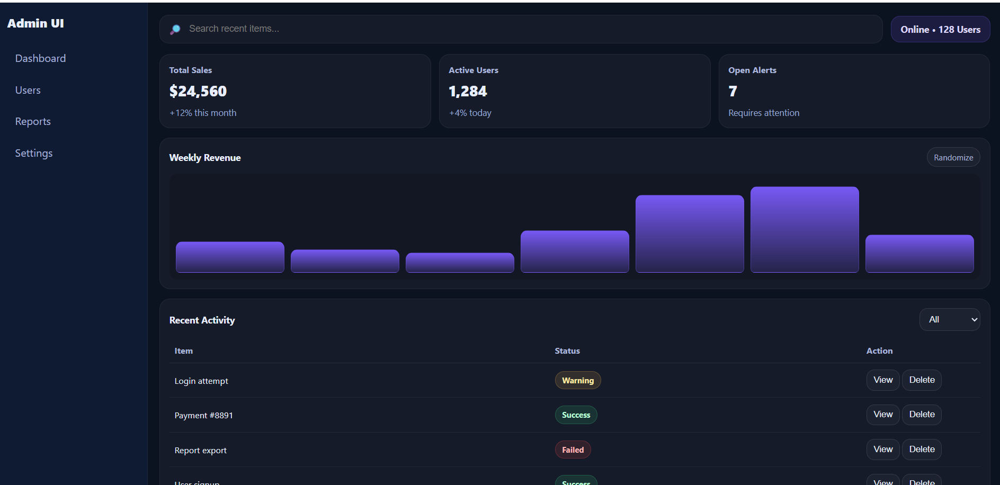
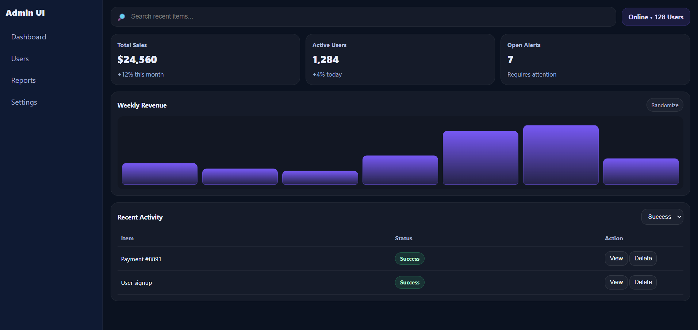
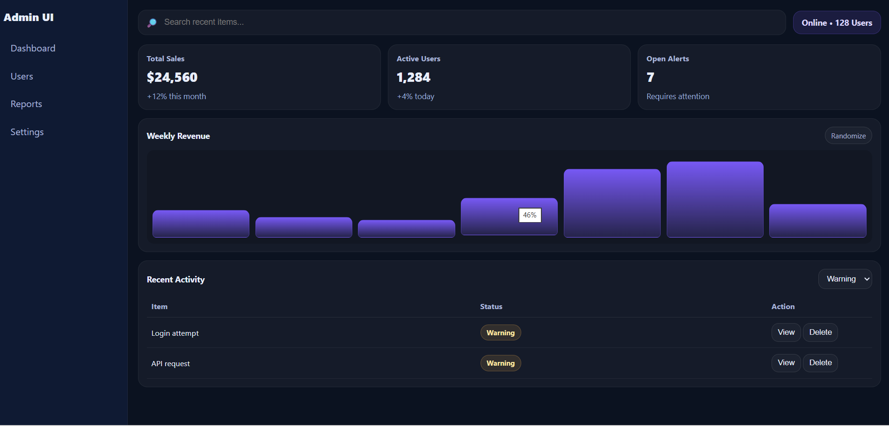
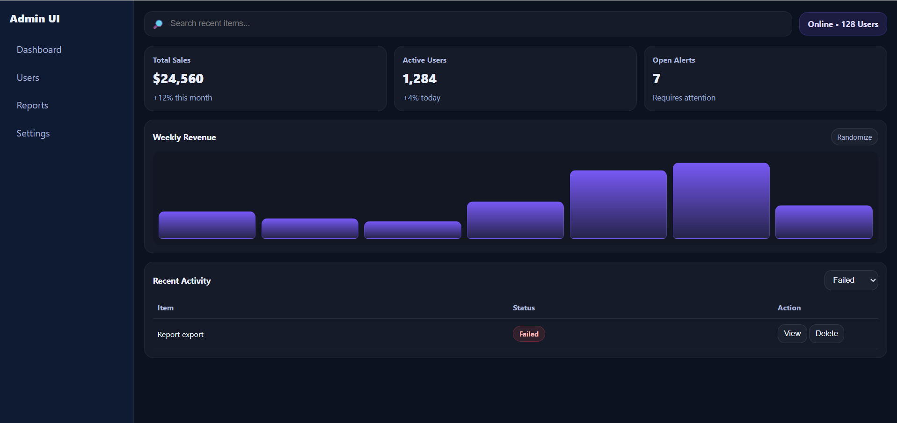

# Admin-dashboard-ui

A modern dark-themed Admin Dashboard built for frontend practice. The dashboard includes statistics cards, a revenue chart, recent activity tracking, search functionality, and filtering features.

## 🌐 Live Demo
singular-dodol-f8d4dd.netlify.app

## ✨ Features

- Responsive admin dashboard layout
- Sidebar navigation
- Statistics cards
- Weekly revenue chart
- Search functionality
- Activity table
- Status filtering
- Dark modern UI design

## 🛠️ Technologies Used

- HTML5
- CSS3
- JavaScript

## 📸 Screenshots

### Dashboard Overview

### Activity Management - View 1

### Activity Management - View 2

### Activity Management - View 3

## 🎯 Purpose of Project

This project was created to practice:

- Dashboard UI design
- JavaScript DOM manipulation
- Search and filter functionality
- Responsive layouts
- Frontend development skills

## 👩‍💻 Author

Nikita
